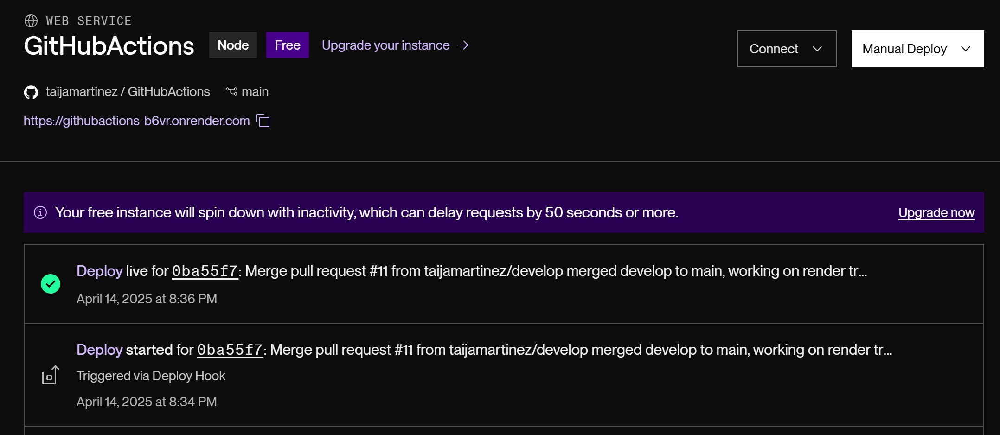

# GitHub Actions

## Table of Contents
- [Description](#description)
- [Screenshots](#screenshots)
- [Installation](#installation)
- [Usage](#usage)
- [Features](#features)
- [License](#license)
- [Contributing](#contributing)
- [Tests](#tests)
- [Credit](#credit)
- [Project Links](#project-links)
- [Questions](#questions)

## Description

This full-stack application presents a 10-question quiz to users, tracks their score, and displays results. For this project, my focus was implementing a complete CI/CD pipeline using **GitHub Actions** and **Render** for automated testing and deployment.

## Screenshots

Here are some previews of the testing:

### ✅ GitHub Actions Workflow Testing

### ✅ Render Auto Triggered Deploy

## Installation
1. Clone the repository: `git clone https://github.com/taijamartinez/GitHubActions`.

2. Navigate into the project directory:
`cd mern-quiz-app`.

3. Install backend dependencies:
`cd server` then `npm install`.

4. Install frontend dependencies:
`cd ../client` then `npm install`.

5. Set up environment variables:
In /server, create a .env file and include:

`MONGODB_URI=mongodb+srv://<your-username>:<your-password>@cluster0.ucgbjnl.mongodb.net/techquiz?retryWrites=true&w=majority&appName=Cluster0`.

6. Run both servers:
`npm run develop`

## Usage

1. Open the app and click Start Quiz.

2. Answer each question before the timer runs out.

3. View your final score at the end.

4. Developers can manage quiz data via the backend API.

## Features

- 🧠 MERN stack architecture (MongoDB, Express, React, Node)

- ⏱ Timed questions with score tracking

- 🧪 Cypress component testing

- 🔁 CI/CD pipeline using GitHub Actions

- 🚀 Auto-deployment to Render on merge to main

- ✅ Pull Request testing before code merges

## License

This application is covered under the MIT license.

## Contributing

If you would like to contribute to my project please follow these steps!

1. Fork the repository on GitHub.
2. Clone your fork to your computer.
3. Create a new branch for your changes.
4. Make your changes and commit them using descriptive messages.
5. Push your branch and open a pull request!

## Tests

To run tests, use the following commands in the root:

`npm run test` and `npm run test-component`.

## Credit

-ChatGPT helped with updating my deploy.yml file to ensure Render would be triggered automatically after code was merged to main.

## Project Links

Repository: https://github.com/taijamartinez/GitHubActions   
Render URL: https://githubactions-b6vr.onrender.com

## Questions

Please reach me here with additional questions:

GitHub: https://github.com/taijamartinez  
Email: taijasmartinez@gmail.com 

Happy coding! 🚀 
